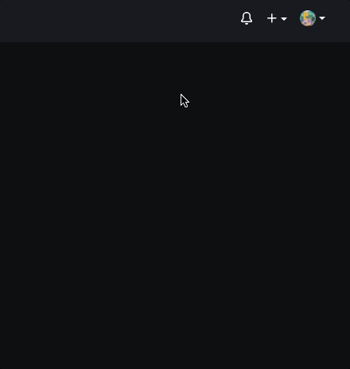
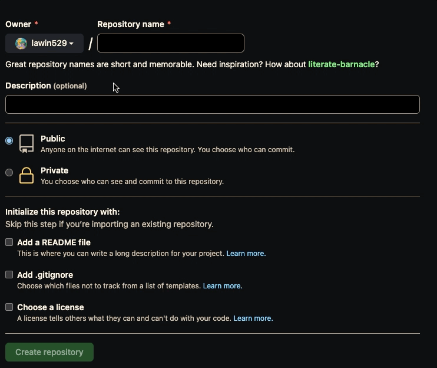
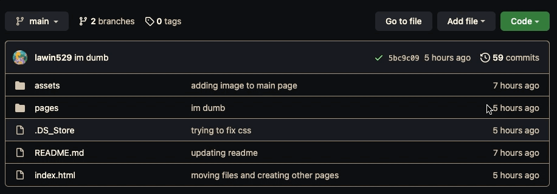
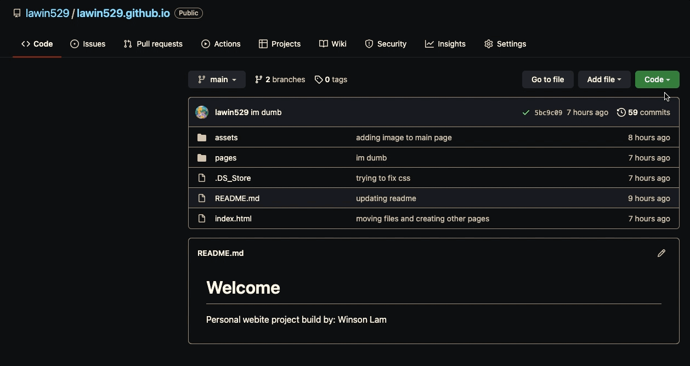
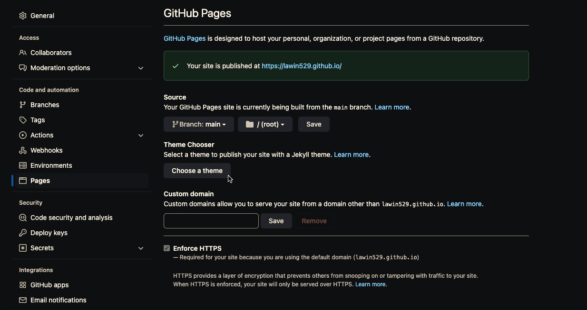

# Static Resume Website

The following project is a static resume website made with *Markdown*, *Github Pages*, and *Jekyll* following Andrew Etter's book [*Modern Technical Writing: An Introduction to Software Documentation*](https://www.amazon.ca/Modern-Technical-Writing-Introduction-Documentation-ebook/dp/B01A2QL9SS).

This document is written for students who are interested in practical application of the principles outlined in Etter's book. No prior experience in Markdown or GitHub is necessary.

## Table of Contents

- [Static Resume Website](#static-resume-website)
  - [Table of Contents](#table-of-contents)
    - [Getting Started](#getting-started)
    - [Prerequisites](#prerequisites)
    - [Instructions](#instructions)
      - [More Resources](#more-resources)
    - [Authors & Acknowledgements](#authors--acknowledgements)
    - [FAQs](#faqs)

### Getting Started

To start, we will be going through what tools we need and how to set them up to get everything done! There will also be references to Etter's principles throughout this document to help tie in what we learn from his book to what we are trying to accomplish. By the end, we should have a working static resume website and learn about modern software documentation along the way!

### Prerequisites

Before we begin, there are a few things that we need to get in order first:

1. **Markdown Resume** - A copy of your resume written in Markdown is essential for this project. [Here](https://www.markdowntutorial.com/) is a very good resource to get you started with Markdown and teach you everything you need to know quickly!
2. **Visual Studio Code** - We will be using *Visual Studio Code* as our editor for the Markdown file, the download of which can be found [here](https://code.visualstudio.com/download).
3. **Git** - *Git* will allow us to make changes remotely and keep a very detailed history of changes made to our site. [Here](https://github.com/git-guides/install-git) is a guide on how to install Git.
4. **Jekyll** - *Jekyll* will generate a static website for us based on our Markdown file, the installation of which can be found [here](https://jekyllrb.com/docs/installation/).
5. **GitHub Account** - Lastly, you will need to have a GitHub account.

### Instructions

Now that we have all of our tools we are able to get started!

0. **Markdown/Lightweight Markup Languages**

   For this project, we will be using *Markdown* as our *lightweight markup language*. As stated in *Etter's* book, lightweight markup languages are designed to make producing well-formed XML (an essential part of building websites) easier. When looking at raw XML, it is not human-readable, while raw *Markdown* is human-readable, making it extremely to write and understand without any previous experience. *Markdown* is the most widely used lightweight markup language in the world and is extremely easy to learn, only taking a few minutes to pick up the basics. However, due to the simplicity of the language, it is very limited in features. We will be using [GitHub Flavoured Markdown (GFM)](https://github.com/adam-p/markdown-here/wiki/Markdown-Cheatsheet) which gives us all the features we need.

1. **Creating Site Repository**

   For this project we will be using *GitHub Pages* which is a way to host our website through the *GitHub* website. `Git` gives us the power of *distributed version control* which gives many benefits including development history, collaboration, and ability to work offline. Using *Git* allows us to publish changes to our website alongside documentation which will help us stay up to date and encourage other developers to contribute.

   1. After logging into GitHub, at the top right of the screen, select the + drop-down menu, and select "**New repository**".

      

   2. Type a name for the repository and an optional description. If you would like to create a user site, your repository must be named `<username>.github.io` so that can be the URL of your site (I have already created a repository with the same name, you should not get an error). Keep the repository `Public` for now, unless you have a Pro account and would like to make your repository private.

      

2. **Download Website to Modify**

   Next, we will be using *Git* to download and modify our website.

   1. Open a ***Terminal/Powershell*** depending on your operating system.
   2. Navigate to where you want to store your website files by running the command and replacing *FOLDER* with your desired location.
      - `$ cd FOLDER`
   3. Next we just want to copy our website files into this folder. We need to grab the URL for our project and run the command replacing *REPO-URL* with the our project URL.
      - `$ git clone REPO-URL`
    
   4. Navigate into repository.
         - `$ cd REPOSITORY-NAME`
   5. Open the repository in Visual Studio Code.
   6. Input your Markdown resume as `index.md`.
   7. Create a `README.md` file if you have not already, this is where you can write a small description/documentation of your website.
   8. Create a `_config.yml` file, this will be for further configuration of *Jekyll*, see [here](https://jekyllrb.com/docs/configuration/) for further details.
   9. Add the files to your repository. The following command adds the files *file1* and *file2* to the repository.
       - `$ git add <file1> <file2>`
   10. Commit the changes to your repository. The following command confirms the changes you want to make with a quick description of what you did for future references.
        - `$ git commit -m '<a description/reason for the changes you just made>'`
   11. Finally, push everything to your repository. The following command sends all changes you just made to the repository on the GitHub website!
        - `$ git push`

3. **Generate our Site with Jekyll and Host with GitHub Pages**

    Now that we have everything setup in terms of files, we are ready to select a theme and launch our site! To generate our *Markdown* file, we will be using *Jekyll*, a *static website generator*. All we need to do is provide *Jekyll* with a lightweight markup file (our resume.md), a theme (through HTML & CSS), and it will create a working static website for us!

    1. Navigate to the `Settings` of your GitHub repository and head to the `Pages` tab on the left.
       

    2. Once we are in the `Pages` section, we can pick what theme we want to use. Select one that you like and press the `Select theme` button in the top right.
       

       > Note: More theme options are available [here](https://github.com/topics/jekyll-theme).

    3. Once you apply the theme, it can take a few minutes for your site to update. However, once your site is ready you should be able to view it at `<username>.github.io`!

4. **Making Changes in the Future**

   All changes to your site will be done through *Git* as shown above and will be published to the same place, defined as [*single source publishing*](https://en.wikipedia.org/wiki/Single-source_publishing), which enforces accuracy and avoids duplication. This also keeps our code and documentation together.

#### More Resources

- [Markdown Tutorial](https://www.markdowntutorial.com/)
- [Markdown Cheatsheet](https://enterprise.github.com/downloads/en/markdown-cheatsheet.pdf)
- [Andrew Etter - Modern Technical Writing: An Introduction to Software Documentation](https://www.amazon.ca/Modern-Technical-Writing-Introduction-Documentation-ebook/dp/B01A2QL9SS)
- [Visual Studio Code Download](https://code.visualstudio.com/download)
- [Install Git](https://github.com/git-guides/install-git)
- [Install Jekyll](https://jekyllrb.com/docs/installation/)
- [Jekyll Config (\_config.yml)](https://jekyllrb.com/docs/configuration/)
- [More Jekyll Themes](https://github.com/topics/jekyll-theme)

### Authors & Acknowledgements

**Author**: Winson Lam ([@lawin529](https://github.com/lawin529/))

**Group Members**:

- Arjun Kaushal
- Braden Jonsson
- Anas Ashfaq Mehar
- Joshua Dueck

**Minimal Theme Author**: Steve Smith ([@orderedlist](https://github.com/orderedlist))

### FAQs

1. *Why am I using Markdown instead of any other word processor?*
   - There are many other *lightweight markup languages* out there, but for this project we used *Markdown* because of the ease to learn and the popularity of the language providing us some sort of future-proofing. *Jekyll* also works seamlessly with the language, making it very easy to customize your static site to your own specific taste!
2. *What other editors can I use besides Visual Studio Code?*
   - While *Visual Studio Code* is recommend in this document for its versitility and ease of use, there are many other editors to choose from. [Here](https://www.oberlo.ca/blog/markdown-editors) is a list of other popular editors that can be explored! Regardless of what is chosen, as long as a proper *Markdown* file is created, the result will be the same.
